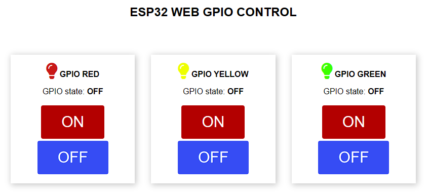
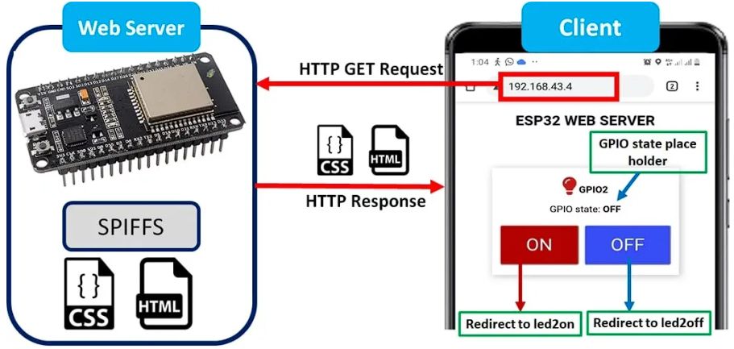

<div align="center">

# ESP32 WEB GPIO CONTROL

</div>

## Folder contents

The project **esp32-web-gpio-control-espidf** contains one source main file in C language [main.c](main/main.c). The file is located in folder [main](main).

This project based on esp32 tutorial [here](https://esp32tutorials.com/esp32-esp-idf-spiffs-web-server/).

This ESP-IDF projects are built using CMake. The project build configuration is contained in `CMakeLists.txt`

Below is short explanation of remaining files in the project folder.

```
├── CMakeLists.txt
├── include
│   ├── connect_wifi.h
│   └──  http_server.h
├── main
│   ├── CMakeLists.txt
│   ├── connect_wifi.c
│   ├── http_server.c
│   ├── Kconfig.projbuild
│   └── main.c
├── spiffs_data
│   └── index.html
└── README.md                  This is the file you are currently reading
```

## How it works

When any user try to access this web server through an IP address, ESP32 SPIFFS web server respond to this HTTP request with a simple HTML and CSS files that represents LED control buttons, LED status, title ‘ESP32 WEB GPIO CONTROL’ and a lamp symbol. During program startup, HTML/CSS file content reads from SPI flash and save in a buffer.

There are three LED Control with two buttons on the GUI that is “ON” button and “OFF” button. User will be able to control ESP32 GPIO through these buttons. 



#### Figure 1. Web GPIO Control Preview



#### Figure 2. Web GPIO Control Flow Diagram. [image source](https://esp32tutorials.com/esp32-esp-idf-spiffs-web-server/)